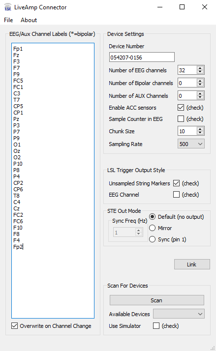

# LSL-LiveAmp
LSL connector for the LiveAmp device from Brain Products.

To download, please click on the 'Latest release' link to the right for the latest versions.

Please note that you may need to install the Microsoft C++ redistributable packages for Visual Studio 2012 ([here](https://support.microsoft.com/en-us/help/2977003/the-latest-supported-visual-c-downloads)) in order to run the executables.

# Getting Started
If you are new to using LSL, you might want to read the [Quick Start guide](https://labstreaminglayer.readthedocs.io/info/getting_started.html) on the LabStreamingLayer main repository. 

For measuring impedances, ensuring good signal quality, and troubleshooting basic amplifier functionality, it is always recommended to use [BrainVision Recorder](https://www.brainproducts.com/downloads.php?kid=2) and to consult the amplifier manual.

You can also find a useful (free) LSL viewer on the Brian Products website: [BrainVision LSL Viewer](https://www.brainproducts.com/downloads.php?kid=40&tab=3).

# Usage

Make sure that you have correctly installed the drivers for your amplifier, and that the amplifier dongle (or dongles in the case of a 64 channel system) is plugged in. Alternatively, with a <=32 channel device, you may be able to connect to a LiveAmp via your PC's built in bluetooth device---which must be enabled.  Make sure that the device is turned on, and that batteries are charged. It is always good to read the manual before operation.

  * Start the LiveAmp Connector app. You should see a window like the following.
> 

## Device Settings

### Device Number

If you know the serial number of the amplifier you want to connect with, you may enter it manually in the 'Device Number' field. Otherwise, you can scan for amplifiers using the 'Scan' button at the bottom of the GUI. After scanning, the 'Available Devices' combo box will be populated with all available devices. The 'Device Number' field will automatically be filled with the number of the first device found. Whichever device is referred to here will be the device that is connected with at the 'Link' action. 

It is highly recommended, when connecting with more than one device, to turn one device on at a time and connect before attempting to connect with another device. The 'Scan' action will not find any device that is alread connected by the 'Link' action.

### EEG/Aux Channels

You can adjust the number of EEG, and AUX channels that the device enables during Link action. Note that if the 'Overwrite on Channel Change' box is checked, changing these values will change the labels in the Channel Labels text box on the left side of the GUI. See the section on Channel Labels below for more information.

### Enable ACC Sensors

Check this box if you wish to include the LiveAmp accelerometer data in your data stream.

### Sample Counter in EEG

When this box is checked, the last channel in the device stream will be a number that increases by 1 at every sample.

### Chunk Size

For most EEG experiments you can ignore the Chunk Size setting, but if you are developing a latency-critical real-time application (e.g., a P300 speller BCI), you can lower this setting to reduce the latency of your system. 

### Sampling Rate

The LiveAmp device has 3 available sampling rates: 250, 500, and 1000Hz. Note that for 64 channel systems, it is not recommended to use the 1000Hz sampling rate.

## LSL Trigger Output Style

These check boxes determine the way that this app handles device triggers in LSL. 

Note that it is possible to enable neither, one of, or both trigger output styles simultaneously. They are not mutually exclusive.

### Unsampled String Markers

If 'Unsampled String Markers' is checked, the app will create a Marker stream on 'Link' that will forward the triggers received at the 1-bit trigger input on the hardware device. This stream will have the name of 'LiveAmpSN-xxxxxx-xxxx-DeviceTrigger' and its sampling rate is 0, i.e. it is a Marker stream 

If the STE box is connected, there will be two Marker streams created. One for the 1-bit amplifier trigger and one for the STE box trigger input. The STE Marker stream will have the name 'LiveAmpSN-xxxxxx-xxxx-STETriggerIn'.

If the STE box is connected and the STE Out Mode is set to 'Sync' there will be a third Marker outlet that corresponds to the hardware triggers sent from the trigger out of the STE box. The name of this Marker stream will be 'LiveAmpSN-xxxxxx-xxxx-STESync'. Note that this is not recommended for 'Unsampled String Markers' as it creates a large number of string markers (one per sample) which is not the intended use of LSL Marker outlets.

### EEG Channel

If this box is checked, extra channels will be added to the EEG/Bipolar/AUX/ACC stream corresponding to the requested trigger outputs. Rather than unsampled markers, these channels will output -1 if no trigger is available, else the value corresponding to the triggers in; and, in the case of the STE box in 'Sync' mode, the sync stream presented at the DSub output of the STE box. 

### Further Information

Please see the file [explanation_of_trigger_marker_types.pdf]( https://github.com/brain-products/LSL-LiveAmp/blob/master/explanation_of_trigger_marker_types.pdf) for more details.

## STE Out Mode

This settings group controls the setup of the STE box's trigger outputs and how the LSL streams will correspondingly behave. 

In 'Default' mode, nothing comes out of the STE box's output port and there is no corresponding LSL stream. In 'Mirror' mode, whatever is at the STE trigger input will be forwarded (in hardware) to the STE box's trigger output port. Since one has the option of recording triggers into the STE box, there is no reason to create an LSL Marker stream or extra EEG channel corresponding to these trigger events. In 'Sync' mode, a TTL pulse goes out of pin 1 of the STE box's output port. The sync frequency is adjustable and a corresponding LSL Marker stream and/or extra EEG channel will be created depending on the chosen 'LSL Trigger Output Style' settings.

### STE/Triggers and LiveAmp64

Please note that in the case of LiveAmp 64, Aux channels can be connected via STE through either the Master (channels 1-32) or Slave (channels 33-64) but triggers will only be read from the STE box connected to the Master device. This is also true for device triggers (i.e. mini headphone jack triggers). If 2 STE boxes are connected, only the Aux channels connected to the Master will be read.

 ## Link

 When pressed, the Link button will attempt to connect to the device specified in the 'Device Number' field. This may take a few moments due to Bluetooth handshaking. When complete, the button text will change to 'Unlink' and all other GUI widgets will be disabled. An error message will pop up if no devices are available.

 When the Connector is linked to the LiveAmp, LSL streams will be created according to the settings set in the GUI. Please note that settings can be saved in a configuration file (see below) for ease of repetition.

## Scan For Devices

When 'Scan' is pressed, the app will search for available LiveAmps. When 1 or more LiveAmps is found, the Serial Numbers of these devices will populate the 'Available Devices' combo box. The first device found will automatically be placed in the 'Device Number' field. When devices are available in the 'Available Devices' box, the user may choose from the available devices in the combo box by interacting with the combo box itself. The chosen device will be forwarded to the 'Device Number' field. If the selected device is unavailable at 'Link', the app will notify the user with an error message. The enumerated devices will also report the type of LiveAmp found (8, 16, 32, or 64 channel).

The LiveAmp device has a simulator mode which can be activated with the 'Use Simulator' checkbox.

## Configuration file

The configuration settings can be saved to a .cfg file (see File / Save Configuration) and subsequently loaded from such a file (via File / Load Configuration). Importantly, the program can be started with a command-line argument of the form "LiveAmp.exe -c myconfig.cfg", which allows to load the config automatically at start-up. The recommended procedure to use the app in experiments is to make a shortcut on the experimenter's desktop which points to a previously saved configuration customized to the study being recorded to minimize the chance of operator error.

## Channel Labels

If the `Overwrite Channel Labels` box is checked, the channel label field will automatically update when you change the number of channels. The chosen channel label is simply an integer number corresponding to the channel number. You can change the channel labels by editing the `Channel Labels` text field directly.

The latest version of the LiveAmp Connector uses [INI](https://en.wikipedia.org/wiki/INI_file) style configuration files (see above) to store preferred settings between sessions. Easier and less error prone than adjusting channel labels in the App's GUI, is to set the channel labels by editing a config file in a text editor and then loading the updated config file. To do so, in the chosen config file simply create a [section](https://en.wikipedia.org/wiki/INI_file#Sections) called `channels` then create a [key](https://en.wikipedia.org/wiki/INI_file#Keys_(properties)) called `labels` with the corresponding labels for each channel separated by commas. For example, a 32 channel 10-20 layout may look like this:

`[channels]`
`labels=Fp1, Fp2, F7, F3, Fz, F4, F8, FC5, FC1, FC2, FC6, T7, C3, Cz, C4, T8, TP9, CP5, CP1, CP2, CP6, TP10, P7, P3, Pz, P4, P8, PO9, O1, Oz, O2, PO10`

The LSL channel meta-data corresponds to the conventions of the XDF file format. These are described [here](https://github.com/sccn/xdf/wiki/EEG-Meta-Data).

## Loading Channel Label Files

Python users may automatically insert channel labels from a .bvef file into an LSL config file. To do so, please use the free utility [BVEF2lslconfig](https://github.com/brain-products/BVEF2lslconfig). You can find many electrode position files with channel labels for common cap configurations on the Brain Products website [here](https://www.brainproducts.com/downloads.php?kid=44). 
